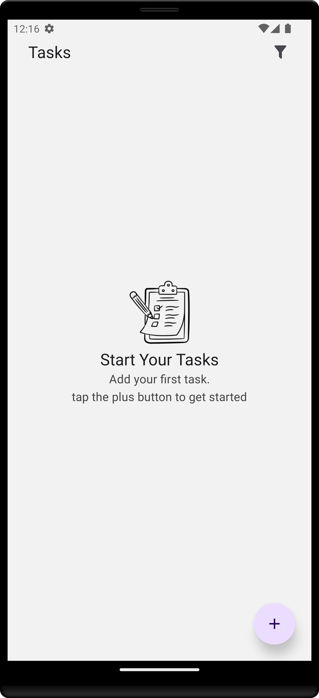
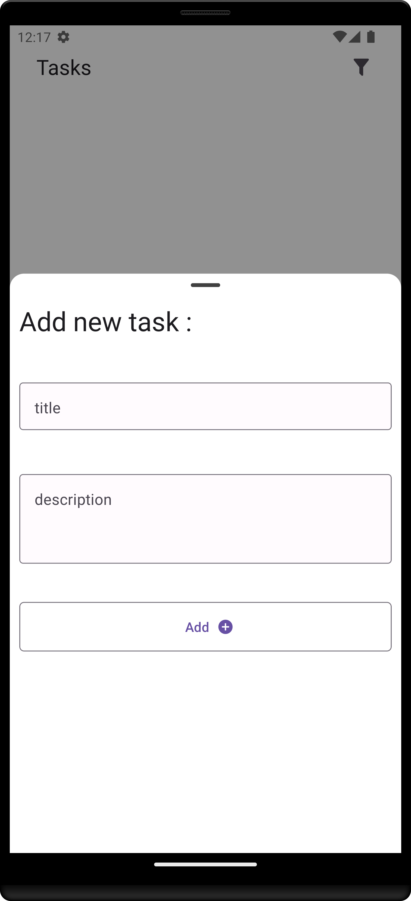
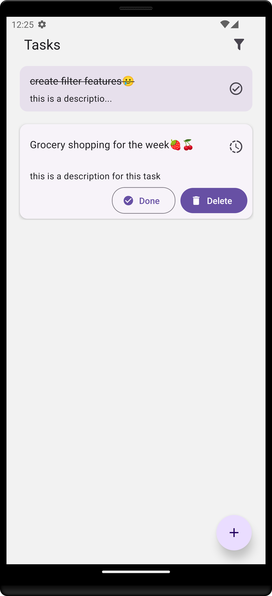

# TODO List App

A TODO list app built with React Native to help you organize your tasks and make you productive.

## Screenshots

<p align="center">
  
  
  
</p>

## Features

- **Add Task**: Add tasks that persist on the device even after closing the app.
- **Remove Task**: Remove tasks that are no longer needed.
- **Mark Task as Done**: Mark tasks as completed.
- **Filter Tasks**: Filter tasks to see all tasks, tasks in progress, or completed tasks.

## Project Structure and Files

The project is organized as follows:

```
my-todo-app/
├── assets/ # Contains images, fonts, and other static assets
│ └── screenshots/ # Screenshots for the README
├── components/ # Reusable UI components
├── hooks/ # Custom hooks for the application
├── utils/ # Utility functions
├── store/ # State management file
└── app/ # Main application screens and navigation
```

## Technologies Used

- **Expo**: A framework and platform for universal React applications that simplifies the development process with tools and services.
- **React Native Paper**: A library that provides Material Design components for React Native, offering a consistent and visually appealing UI.
- **Context API**: A React feature for managing global state and passing data through the component tree without prop drilling.
- **Async Storage**: A simple, asynchronous, and persistent storage system for React Native, used to store data locally on the device.
- **Bottom Sheet**: A component that provides a sliding panel from the bottom of the screen, commonly used for additional options or actions.
- **FlashList**: A high-performance list component for React Native that supports large datasets efficiently.
- **Lottie**: A library for rendering animations in React Native using JSON-based animations created with Adobe After Effects.
- **Tailwind CSS**: A utility-first CSS framework used for styling the application with a set of predefined classes.
- **Expo Router**: A routing library for Expo that simplifies navigation and routing within the application.

## Run Locally

Clone the project

```bash
  git clone https://github.com/YounessHassoune/webeasy-test
```

Go to the project directory

```bash
  cd webeasy-test
```

Install dependencies

```bash
  pnpm install
```

Start the server

```bash
  pnpm start
```

Run the Project on Your Phone:

- Open the Expo Go app on your phone.
- Scan the QR code displayed in the terminal or browser.

## Deployment

### Deploy to App Store (iOS)

1. **Prepare Your App**:

   - Update `app.json`.
   - Generate an iOS build: `expo build:ios`.

2. **Set Up an Apple Developer Account**:

   - Enroll in the Apple Developer Program.

3. **Create an App Record in App Store Connect**:

   - Sign in to App Store Connect and create a new app record.

4. **Submit Your App**:

   - Download the `.ipa` file from Expo and upload it using Transporter or Xcode.
   - Complete the submission in App Store Connect.

5. **App Review**:
   - Await review and approval from Apple.

### Deploy to Google Play (Android)

1. **Prepare Your App**:

   - Update `app.json`.
   - Generate an Android build: `expo build:android`.

2. **Set Up a Google Play Developer Account**:

   - Enroll in the Google Play Developer Program.

3. **Create an App Record in Google Play Console**:

   - Sign in to Google Play Console and create a new application.

4. **Upload Your App**:

   - Download the `.apk` or `.aab` file from Expo and upload it to Google Play Console.
   - Complete the submission process.

5. **App Review**:

   - Await review and approval from Google.

### How to Deploy the Project Using EAS Build

EAS Build is a service provided by Expo for building and deploying React Native apps. It streamlines the build process for both iOS and Android platforms.

1. **Set Up EAS Build**:

   - Install the EAS CLI using `npm install -g eas-cli`.
   - Log in to EAS with `eas login`.
   - Configure your project by running `eas build:configure`.

2. **Configure Your Build**:

   - Create or update the `eas.json` file in your project root to define build profiles and settings.

3. **Build Your App**:

   - Build for iOS using `eas build --platform ios`.
   - Build for Android using `eas build --platform android`.
   - Build for both platforms simultaneously with `eas build --platform all`.

4. **Monitor and Submit**:
   - Track the build process on the Expo Dashboard.
   - Submit your app to the App Store and Google Play using `eas submit --platform ios` and `eas submit --platform android`, respectively.

EAS Build simplifies the process of preparing your app for distribution, making it easier to get your app into the hands of users.

## Author

- [@Youness Hassoune](https://github.com/YounessHassoune)
